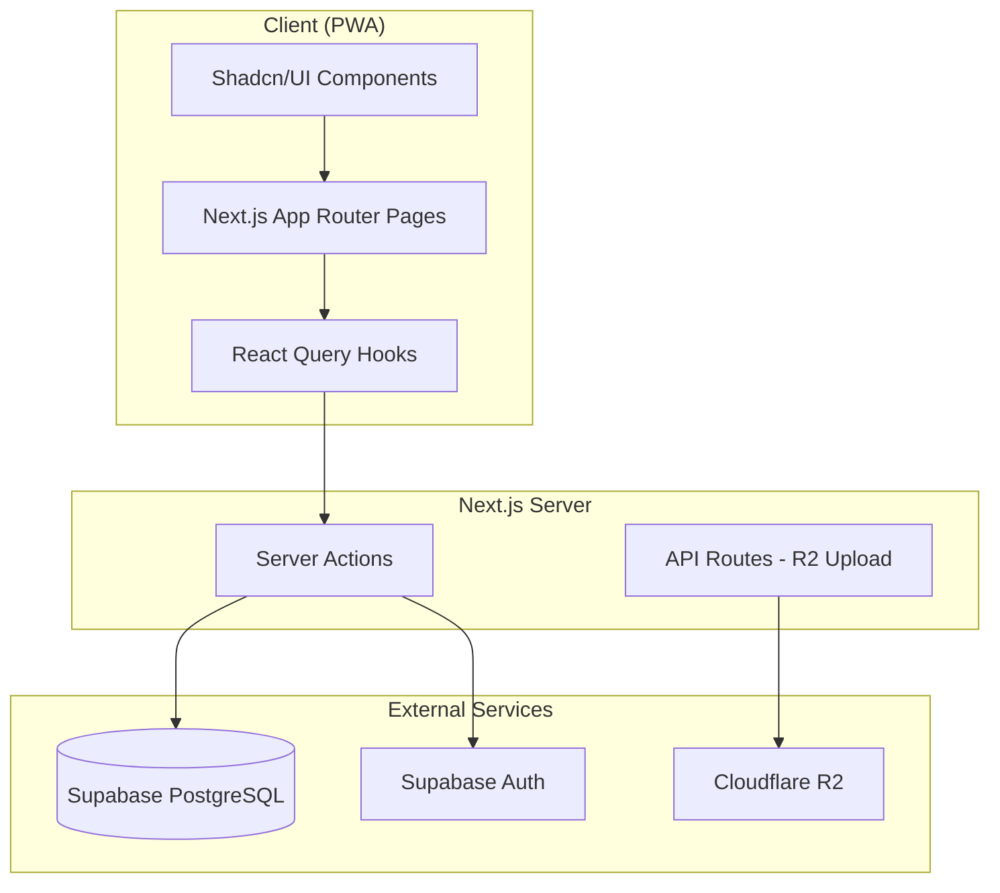

# Design Document: Sargodha Citrus Ops

## Overview

Sargodha Citrus Ops is a Progressive Web App (PWA) operations dashboard for a 3-partner orange-selling business. The system provides financial transparency through partner ledger tracking, transaction logging with receipt uploads, order management with margin calculations, operational journaling, and real-time analytics.

**Tech Stack:**
- **Frontend:** Next.js 14 (App Router), React 18, Shadcn/UI, TailwindCSS
- **Backend:** Next.js API Routes (Server Actions)
- **Database:** Supabase (PostgreSQL)
- **Authentication:** Supabase Auth (Email/Password with invite-only)
- **Image Storage:** Cloudflare R2
- **Deployment:** Vercel

**Design Principles:**
- **Mobile-First:** All UI components designed for mobile screens first, then scaled up for desktop
- **Touch-Friendly:** Large tap targets (min 44px), swipe gestures where appropriate
- **Quick Entry:** Optimized forms for fast data entry in the field

## Architecture



**Key Architectural Decisions:**

1. **Server Actions over API Routes:** Use Next.js Server Actions for database operations (simpler, type-safe). API routes only for R2 file uploads.

2. **Supabase Row Level Security (RLS):** All tables protected by RLS policies ensuring only authenticated partners can access data.

3. **Optimistic Updates:** Use React Query for client-side caching with optimistic updates for responsive UX.

4. **Immutable Financial Records:** Transactions and orders use soft-delete patterns; no hard deletes allowed.

## Components and Interfaces

### Page Structure

```
/app
├── (auth)
│   ├── login/page.tsx
│   └── layout.tsx
├── (dashboard)
│   ├── layout.tsx (sidebar + header)
│   ├── page.tsx (Analytics Dashboard)
│   ├── ledger/page.tsx (Partner Ledger)
│   ├── transactions/page.tsx (Transaction Log)
│   ├── orders/page.tsx (Order Tracker)
│   └── journal/page.tsx (Journal Timeline)
└── api
    └── upload/route.ts (R2 upload endpoint)
```

### Core Components

| Component | Purpose | Props |
|-----------|---------|-------|
| `PartnerCard` | Display partner contribution summary | `partner: Partner` |
| `TransactionForm` | Create new transaction with receipt | `onSubmit: (data) => void` |
| `TransactionList` | Filterable transaction feed | `filters: TransactionFilters` |
| `OrderCard` | Display order with status badge | `order: Order` |
| `OrderStatusSelect` | Status transition dropdown | `currentStatus, onUpdate` |
| `JournalEntry` | Timeline entry with images | `entry: JournalEntry` |
| `StatCard` | Analytics metric display | `title, value, trend?` |
| `ImageUpload` | R2 image upload with preview | `onUpload: (url) => void, required?: boolean` |
| `MobileNav` | Bottom navigation bar for mobile | `activeRoute: string` |
| `QuickAddFAB` | Floating action button for quick entry | `onAdd: () => void` |

**Mobile-First UI Patterns:**
- Bottom navigation bar (not sidebar) on mobile
- Floating Action Button (FAB) for quick transaction/order entry
- Pull-to-refresh on list views
- Card-based layouts with large touch targets
- Collapsible filters on mobile

### Service Layer

```typescript
// lib/services/transactions.ts
export const transactionService = {
  create: (data: CreateTransactionInput) => Promise<Transaction>,
  list: (filters?: TransactionFilters) => Promise<Transaction[]>,
  getById: (id: string) => Promise<Transaction>,
}

// lib/services/orders.ts
export const orderService = {
  create: (data: CreateOrderInput) => Promise<Order>,
  list: (filters?: OrderFilters) => Promise<Order[]>,
  updateStatus: (id: string, status: OrderStatus) => Promise<Order>,
}

// lib/services/analytics.ts
export const analyticsService = {
  getDashboardStats: () => Promise<DashboardStats>,
  getPartnerPayouts: () => Promise<PartnerPayout[]>,
}
```

## Data Models

### Database Schema (Supabase PostgreSQL)

```sql
-- Partners (synced from Supabase Auth)
CREATE TABLE partners (
  id UUID PRIMARY KEY REFERENCES auth.users(id),
  name TEXT NOT NULL,
  email TEXT UNIQUE NOT NULL,
  created_at TIMESTAMPTZ DEFAULT NOW()
);

-- Transactions (Capital + Expenses)
CREATE TABLE transactions (
  id UUID PRIMARY KEY DEFAULT gen_random_uuid(),
  partner_id UUID NOT NULL REFERENCES partners(id),
  amount INTEGER NOT NULL, -- PKR, no decimals
  category TEXT NOT NULL CHECK (category IN ('marketing', 'packaging', 'fruit_stock', 'logistics', 'food_misc', 'capital_injection')),
  description TEXT NOT NULL,
  receipt_url TEXT, -- Optional but encouraged for audit trail
  has_receipt BOOLEAN GENERATED ALWAYS AS (receipt_url IS NOT NULL) STORED,
  created_at TIMESTAMPTZ DEFAULT NOW()
);

-- Orders
CREATE TABLE orders (
  id UUID PRIMARY KEY DEFAULT gen_random_uuid(),
  customer_name TEXT NOT NULL,
  product_variant TEXT NOT NULL CHECK (product_variant IN ('10kg', '5kg')),
  quantity INTEGER NOT NULL DEFAULT 1,
  sell_price INTEGER NOT NULL, -- PKR per unit
  status TEXT NOT NULL DEFAULT 'pending' CHECK (status IN ('pending', 'shipped', 'delivered', 'returned')),
  created_by UUID NOT NULL REFERENCES partners(id),
  created_at TIMESTAMPTZ DEFAULT NOW()
);

-- Order Status History (Audit Trail)
CREATE TABLE order_status_history (
  id UUID PRIMARY KEY DEFAULT gen_random_uuid(),
  order_id UUID NOT NULL REFERENCES orders(id),
  old_status TEXT,
  new_status TEXT NOT NULL,
  changed_by UUID NOT NULL REFERENCES partners(id),
  changed_at TIMESTAMPTZ DEFAULT NOW()
);

-- Journal Entries
CREATE TABLE journal_entries (
  id UUID PRIMARY KEY DEFAULT gen_random_uuid(),
  partner_id UUID NOT NULL REFERENCES partners(id),
  content TEXT,
  image_urls TEXT[], -- Array of R2 URLs
  created_at TIMESTAMPTZ DEFAULT NOW(),
  CONSTRAINT content_or_image CHECK (content IS NOT NULL OR array_length(image_urls, 1) > 0)
);

-- Invited Emails (for registration restriction)
CREATE TABLE invited_emails (
  email TEXT PRIMARY KEY,
  invited_at TIMESTAMPTZ DEFAULT NOW()
);
```

### TypeScript Types

```typescript
// types/index.ts
export type TransactionCategory = 
  | 'marketing' 
  | 'packaging' 
  | 'fruit_stock' 
  | 'logistics' 
  | 'food_misc' 
  | 'capital_injection';

export type ProductVariant = '10kg' | '5kg';
export type OrderStatus = 'pending' | 'shipped' | 'delivered' | 'returned';

export interface Partner {
  id: string;
  name: string;
  email: string;
  totalContribution: number;
  totalExpenses: number;
  contributionPercentage: number;
}

export interface Transaction {
  id: string;
  partnerId: string;
  partnerName: string;
  amount: number;
  category: TransactionCategory;
  description: string;
  receiptUrl?: string;
  hasReceipt: boolean; // Visual indicator for audit completeness
  createdAt: Date;
}

export interface Order {
  id: string;
  customerName: string;
  productVariant: ProductVariant;
  quantity: number;
  sellPrice: number;
  status: OrderStatus;
  netMargin: number; // Calculated
  createdBy: string;
  createdAt: Date;
}

export interface JournalEntry {
  id: string;
  partnerId: string;
  partnerName: string;
  content?: string;
  imageUrls: string[];
  createdAt: Date;
}

export interface DashboardStats {
  totalRevenue: number;
  totalExpenses: number;
  totalFixedCosts: number;
  profit: number;
  roi: number;
  returnRate: number;
  totalOrders: number;
  deliveredOrders: number;
  returnedOrders: number;
}

export interface PartnerPayout {
  partnerId: string;
  partnerName: string;
  contribution: number;
  profitShare: number; // Profit / 3
  totalPayout: number; // contribution + profitShare
}
```

### Margin Calculation Logic

```typescript
// lib/utils/calculations.ts
const FIXED_COSTS = {
  '10kg': 1720,
  '5kg': 860,
} as const;

export function calculateNetMargin(
  variant: ProductVariant, 
  sellPrice: number, 
  quantity: number
): number {
  const fixedCost = FIXED_COSTS[variant];
  return (sellPrice - fixedCost) * quantity;
}

export function calculateProfit(
  totalRevenue: number,
  totalFixedCosts: number,
  totalExpenses: number
): number {
  return totalRevenue - totalFixedCosts - totalExpenses;
}

export function calculatePartnerPayout(
  contribution: number,
  totalProfit: number
): number {
  const profitShare = totalProfit / 3;
  return contribution + profitShare;
}
```


## Correctness Properties

*A property is a characteristic or behavior that should hold true across all valid executions of a system-essentially, a formal statement about what the system should do. Properties serve as the bridge between human-readable specifications and machine-verifiable correctness guarantees.*

### Property 1: Transaction Contribution Invariant
*For any* transaction (capital injection or expense), when recorded, the partner's total contribution SHALL increase by exactly the transaction amount, and the common pool SHALL increase by the same amount.
**Validates: Requirements 2.1, 2.2**

### Property 2: Net Margin Calculation
*For any* order with a given product variant, quantity, and sell price, the calculated net margin SHALL equal `(sellPrice - fixedCost) * quantity` where fixedCost is 1720 for 10kg variant and 860 for 5kg variant.
**Validates: Requirements 4.2, 4.3**

### Property 3: Order Status Transitions
*For any* order, status transitions SHALL only be valid in the following paths: Pending→Shipped, Shipped→Delivered, Shipped→Returned. All other transitions SHALL be rejected.
**Validates: Requirements 4.5**

### Property 4: Status Change Audit Trail
*For any* order status change, the system SHALL create a corresponding history record with the old status, new status, changing partner, and timestamp.
**Validates: Requirements 4.6, 7.4**

### Property 5: Transaction Immutability
*For any* existing transaction, delete operations SHALL be rejected and the transaction SHALL remain in the database unchanged.
**Validates: Requirements 7.3**

### Property 6: Profit Calculation
*For any* set of delivered orders and expense transactions, profit SHALL equal `totalRevenue - totalFixedCosts - totalExpenses` where totalRevenue is sum of (sellPrice * quantity) for delivered orders, totalFixedCosts is sum of (fixedCost * quantity) for delivered orders, and totalExpenses is sum of all expense transactions.
**Validates: Requirements 6.3, 6.6**

### Property 7: Partner Payout Calculation
*For any* partner with a given contribution amount and total profit, the partner's payout SHALL equal `contribution + (profit / 3)`.
**Validates: Requirements 6.7, 6.8**

### Property 8: ROI Calculation
*For any* profit value and total capital contributed, ROI SHALL equal `(profit / totalCapital) * 100`. When totalCapital is zero, ROI SHALL be zero.
**Validates: Requirements 6.4**

### Property 9: Return Rate Calculation
*For any* set of orders, return rate SHALL equal `(returnedOrders / totalOrders) * 100`. When totalOrders is zero, return rate SHALL be zero.
**Validates: Requirements 6.5**

### Property 10: Transaction Validation
*For any* transaction creation attempt, the system SHALL reject transactions missing amount, category, or description fields.
**Validates: Requirements 3.1**

### Property 11: Order Validation
*For any* order creation attempt, the system SHALL reject orders missing customer name, product variant, quantity, or sell price fields.
**Validates: Requirements 4.1**

### Property 12: Journal Entry Validation
*For any* journal entry creation attempt, the system SHALL reject entries that have neither text content nor at least one image.
**Validates: Requirements 5.1**

### Property 13: Chronological Ordering
*For any* list of transactions or journal entries, items SHALL be sorted in reverse chronological order (newest first) by creation timestamp.
**Validates: Requirements 3.4, 5.3**

### Property 14: Transaction Filter Correctness
*For any* filter criteria (category, partner, date range), the filtered transaction list SHALL contain only transactions matching ALL specified criteria.
**Validates: Requirements 3.6**

### Property 15: Invite-Only Registration
*For any* registration attempt, the system SHALL allow registration only for email addresses present in the invited_emails table.
**Validates: Requirements 1.5**

## Error Handling

### Client-Side Errors

| Error Type | Handling Strategy |
|------------|-------------------|
| Validation Error | Display inline field errors using Shadcn form validation |
| Network Error | Show toast notification with retry option |
| Auth Error | Redirect to login with error message |
| Upload Error | Show toast with specific error, allow retry |

### Server-Side Errors

| Error Type | HTTP Status | Response |
|------------|-------------|----------|
| Validation Failed | 400 | `{ error: string, fields?: Record<string, string> }` |
| Unauthorized | 401 | Redirect to login |
| Forbidden | 403 | `{ error: "Access denied" }` |
| Not Found | 404 | `{ error: "Resource not found" }` |
| Server Error | 500 | `{ error: "Internal server error" }` |

### Database Constraints

- Foreign key violations → Return user-friendly error
- Check constraint violations → Return validation error
- Unique constraint violations → Return "already exists" error

## Testing Strategy

### Property-Based Testing

**Library:** [fast-check](https://github.com/dubzzz/fast-check) for TypeScript

Property-based tests will verify the correctness properties defined above. Each test will:
- Generate random valid inputs using fast-check arbitraries
- Execute the function/operation under test
- Assert the property holds for all generated inputs
- Run minimum 100 iterations per property

**Test File Naming:** `*.property.test.ts`

**Example Structure:**
```typescript
// lib/utils/__tests__/calculations.property.test.ts
import fc from 'fast-check';
import { calculateNetMargin, calculateProfit } from '../calculations';

describe('Net Margin Calculation', () => {
  // **Feature: sargodha-citrus-ops, Property 2: Net Margin Calculation**
  it('should calculate margin as (sellPrice - fixedCost) * quantity for any valid order', () => {
    fc.assert(
      fc.property(
        fc.constantFrom('10kg', '5kg'),
        fc.integer({ min: 1, max: 10000 }),
        fc.integer({ min: 1, max: 100 }),
        (variant, sellPrice, quantity) => {
          const fixedCost = variant === '10kg' ? 1720 : 860;
          const expected = (sellPrice - fixedCost) * quantity;
          const result = calculateNetMargin(variant, sellPrice, quantity);
          return result === expected;
        }
      ),
      { numRuns: 100 }
    );
  });
});
```

### Unit Testing

**Library:** Vitest (fast, ESM-native, compatible with Next.js)

Unit tests will cover:
- Edge cases (zero values, empty arrays, boundary conditions)
- Error conditions (invalid inputs, missing fields)
- Integration points (Supabase queries, R2 uploads)

**Test File Naming:** `*.test.ts`

### Test Organization

```
/lib
├── utils/
│   ├── calculations.ts
│   └── __tests__/
│       ├── calculations.test.ts        # Unit tests
│       └── calculations.property.test.ts # Property tests
├── services/
│   ├── transactions.ts
│   └── __tests__/
│       ├── transactions.test.ts
│       └── transactions.property.test.ts
```

### Testing Requirements

1. Each correctness property MUST have a corresponding property-based test
2. Property tests MUST run minimum 100 iterations
3. Property tests MUST be tagged with format: `**Feature: sargodha-citrus-ops, Property {number}: {property_text}**`
4. Unit tests cover specific examples and edge cases
5. No mocking of core calculation logic—test real implementations
